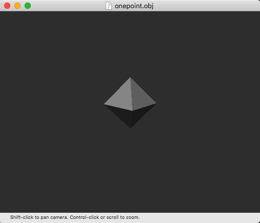
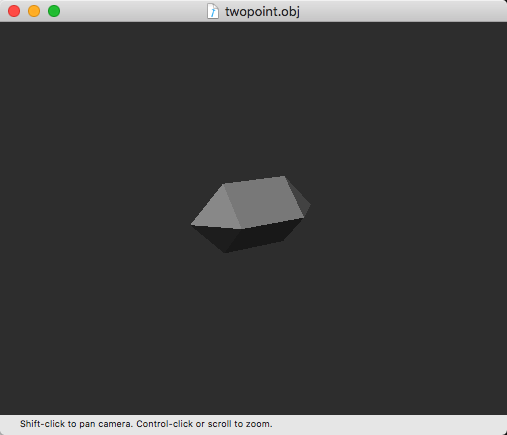
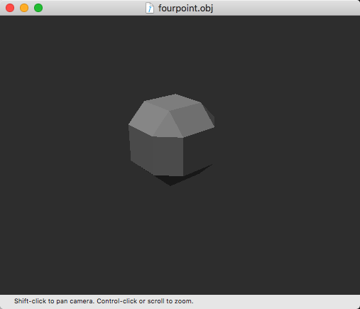
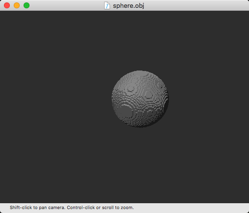
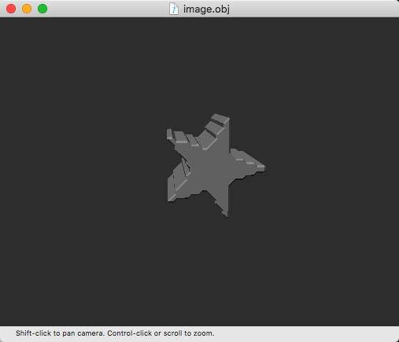
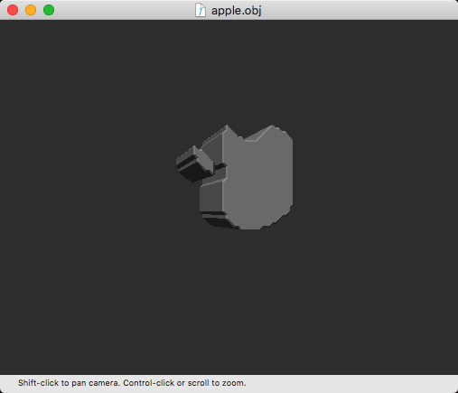
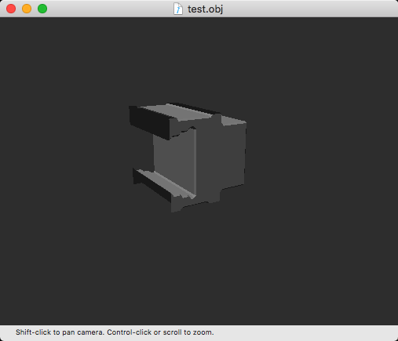
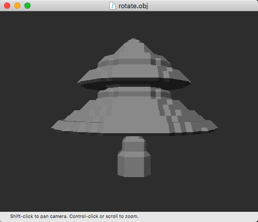

Marching Cubes
===

1. 用python实现Marching Cubes算法，生成obj模型。
2. 避免重新造轮子，Marching Cubes的Pattern查找表从[MarchingCubes Tables][1]提取。
3. 环境：Mac + python2.7 + objViewer 
   * glm
   * pillow

## 例子

### 一个中心点

### 两个点

### 四个点

### 实体球

## 复杂的模型

### 五角星

### Apple

### test

### Tree

[1]:http://users.polytech.unice.fr/~lingrand/MarchingCubes/applet.html	"Marching Cubes"

